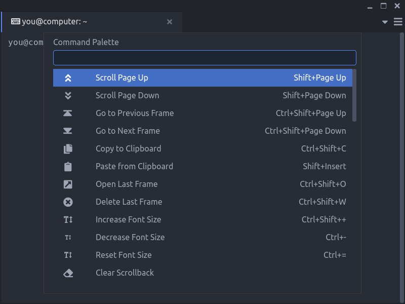
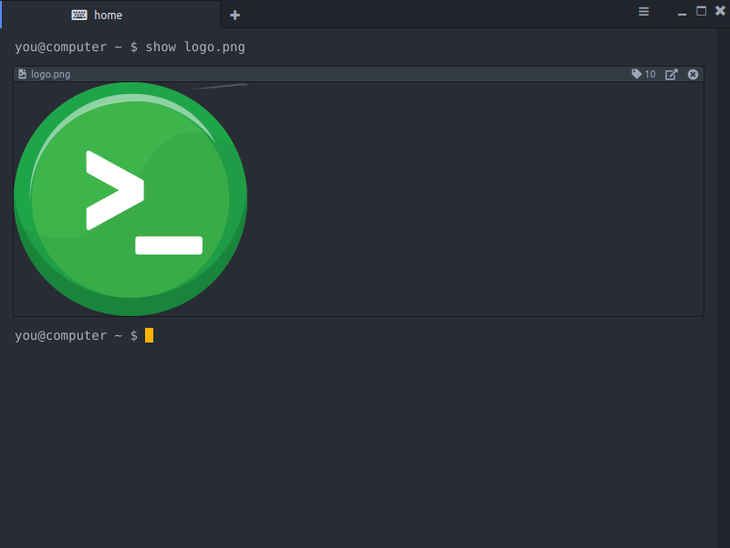
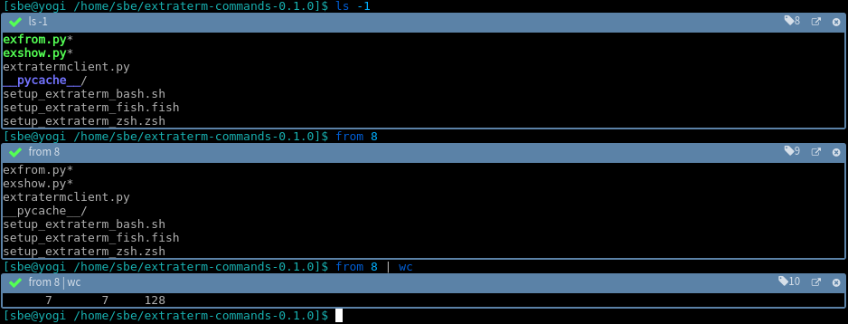

- [Getting Started](#getting-started)
  - [Installation](#installation)
- [Basics](#basics)
  - [Cursor Mode](#cursor-mode)
  - [Command Palette](#command-palette)
- [Shell Integration](#shell-integration)
  - [The 'show' Command](#the-show-command)
  - [The 'from' Command](#the-from-command)
  - [Executing Commands from Cursor Mode](#executing-commands-from-cursor-mode)
- [Splits and Panes](#splits-and-panes)
  - [Drag and Drop](#drag-and-drop)
- [Editing in Cursor Mode](#editing-in-cursor-mode)
- [Viewing content with the Show Command](#viewing-content-with-the-show-command)
  - [Frames viewing Text](#frames-viewing-text)
- [Tips](#tips)
  - [Keyboard Shortcuts](#keyboard-shortcuts)
  - [Mouse selections when an app grabs the mouse](#mouse-selections-when-an-app-grabs-the-mouse)

Note: Keyboard shortcuts given in the documentation apply to the default Windows/Linux shortcuts.

# Getting Started

## Installation

Extraterm supports Linux, macOS and WSL, CMD, PowerShell and Cygwin on Windows. Download the zip file, installer or DMG for your operating system on the [github releases page](https://github.com/sedwards2009/extraterm/releases).

Start Extraterm:

* **Linux** - Unzip the file somewhere convenient. Click to run the `extraterm` file inside the unzip directory.
* **macOS** - Open the DMG file and drag the Extraterm onto the Applications folder. Just start Extraterm via the Finder.
* **Windows** - Run the installer to install. Start Extraterm from the start menu. Note you must have Python 3 installed inside cygwin for Extraterm to run (see the [FAQ](faq.md) ). If you have trouble starting Extraterm on cygwin also consult the [FAQ](faq.md).

-----------

# Basics

When Extraterm starts it opens one tab and runs your default shell inside it. The basic functioning of the terminal should feel quite familiar.

Multiple terminals can be open at the same time in different tabs. The plus sign next to the tab at the top of the window opens a new tab (shortcut `Ctrl+Shift+T`). Close a tab by using the little cross icon/button on the right side of the tab, or just exist the shell. `Ctrl+Shift+Q` is the shortcut for closing a tab directly.

Use the `Ctrl+,` and `Ctrl+.` shortcuts to move left and right between tabs.

Selections can be made with the mouse and are automatically copied to the system clipboard. `Ctrl+Shift+C` will also copy a selection. `Ctrl+Shift+V`, `Ctrl+Insert` or the middle mouse button pastes the contents of the clipboard into the terminal.

The scrollbar on the right or `Shift+PageUp` and `Shift+PageDown` let you can scroll through and view previous output.

The "hamburger" menu is in the top right corner of the window.

## Cursor Mode

Extraterm features a cursor mode where you can navigate the screen and scrollback contents and select text in the terminal without having to reach for the mouse.

To go into cursor mode press `Ctrl+Shift+Space`. The block cursor will remain in place but there will also be a blinking vertical bar cursor. This is Extraterm's cursor mode cursor. It works the same as the cursor in a typical desktop text editor. Cursor keys work the same and `shift` + cursor creates selections.

`Ctrl+Shift+C` (or just `Ctrl+C`) copies the selection to the clipboard. The cursor can be placed using the mouse. When in cursor mode no keyboard input is sent to your shell.

The `Ctrl+Shift+Space` shortcut acts as a toggle between cursor mode and normal terminal mode. Press it again to go back to terminal mode.

See [Executing Commands from Cursor Mode](#executing-commands-from-cursor-mode) also.

## Command Palette

The Command Palette is a pop up menu of commands which can be easily searched and selected from via the keyboard. It grants direct access to all of Extraterm's commands and actions. Open it using `Ctrl+Shift+P`. Commands which are specific to the current context appear at the top of the menu. Cursor up/down and PageUp/PageDown keys move the selection. The `Enter` key executes the selected command, while the escape key closes the palette. The items in the menu can be filtered by entering search text.

-----------

# Shell Integration

Extraterm becomes a lot more useful once the shell integration has been set up. Currently the three major shells, bash, zshell and fish are supported.

Go to the [github releases page](https://github.com/sedwards2009/extraterm/releases) and download the `extraterms-commands` zip file. Unzip this file somewhere. Inside are a number of scripts called `setup_extraterm...`. Use your shell's source command to read the script which matches your shell.

Read the script matches your shell using the `.` (source) built in command. For example: bash shell would use `. setup_extraterm_bash.sh` to read the script. The other shells use the same syntax.

Ideally you would read the `setup_extraterm...` script as part of your login scripts.

The shell integration does a couple of things:

* hooks into your shell to report commands invocations to Extraterm.
* hooks into your shell to report the result of command invocations.
* puts two useful commands in your path: `show` and `from`.

When you run a command in your shell, Extraterm can now place a 'frame' around the output of the command. This frame is decorated with the name of the command, an indication of whether it returned a successful zero return code, and also some other controls.

Successful commands are shown with a green check mark on a blue background. Failed commands are shown with a red background to get your attention.

When scrolling back through long stretches of command output, the frame's title bar will remain visible so that you know what you are looking at.

The cross icon in the frame title simply deletes the command output. The 'pop out' icon moves the output into its own tab for safe keeping.

The framing behaviour can be configured in the Setting tab, accessible from the drop down menu located at the 'burger' menu in the top right corner of the main window. By default a number of common unix commands which don't produce output are configured to not be framed.

In the future more shortcuts and features will be added to make more use of this framing and shell integration.

## The 'show' Command

The shell integration adds a pair of new Extraterm specific commands to your shell. The `show` command is a general tool for showing the contents of a file inside the terminal. Currently it supports showing and highlighting many programming languages and mark up languages. It can also show the most common image formats directly in the terminal.

'show' accepts filenames as arguments and will download an show them. It is also possible to pipe data directly into 'show' via stdin.

'show' supports a number of command line options. These options are related to specifying what kind of data is being shown. Most of the time 'show' can figure this out for itself but when piping data directly into 'show' it is sometimes useful to set them.

* **--charset <*charset*>** the character set used by the file. This is only relevant for text files.
* **--mimetype <*mimetype*>** the mimetype of the file
* **--filename <*filename*>** the file name to associate with the file
* **-t, --text** treat the file as plain text. Convenient alternative to `--mimetype text/plain`

Other options:

* **-d, --download** specify this option to show the file as a download and not in a specific viewer

## The 'from' Command

The `from` command is lets you use previous command output as input to a new command. Each command frame has a little tag icon in the title bar with a number. By running the `from` command with the number of the frame you want as its argument you can get the contents of that frame.

For example:

This example is somewhat artificial but it does show the basic use of `from`.

The `from` command isn't limited to read command output from the same terminal session or tab. It can read from any other tab. The command output doesn't have to be from a command on the same machine. It could be from a command on the other side of a ssh session.

The `from` command becomes a lot more useful when you first edit the content of a frame in place to isolate the text you want. The content of frames can be edited when in the selection mode.

For example, I've run `git status` and have a couple of changes. I want to know how many words long the documents I have been working on are, but I'm not interested in the .ts ones. This is the situation after `git status`:

Now I can go into selection mode and cut away the parts of the text I don't need and pull it into my pipe line.

With a shell pipe and `xargs` I can give the list of documents to the `wc` (word count) command:

Using the `--save` or `-s` option `from` can directly write the frame contents to disk using the file's original filename.

## Executing Commands from Cursor Mode

Command output in a frame can be edited directly. Extraterm also has some shortcuts to make this capability even more useful.

* `Ctrl+Enter` will type the currently selected text into the shell.
* `Ctrl+Shift+Enter` will type the currently select text into the shell and press the enter key. Effectively it executes the selection in the shell. Use with care.

-----------

# Splits and Panes

Each terminal is contained in its own tab. New tabs can be opened by clicking on the new tab button '+' up in the tab bar, or using `Ctrl+Shift+T`. Tabs can be 'split' half horizontally or vertically using the `Horizontal Split` and `Vertical Split` commands which can be found in the [Command Palette](#command-palette). When a tab is split, it is moved to the side and the Pane Menu appears in the remaining space or 'pane'. The menu allows you to create a new terminal, more splits or to close the pane.

## Drag and Drop

Extraterm supports mouse based gestures for rearranging tabs in the tab bar, moving them between groups of tabs, and splitting tabs to create extra panes.

* Tabs can be moved between groups of tabs by dragging them from one group to the other.
* Frames can be dragged by their title bars up into a group of tabs to move them out of their terminal and into their own tab.
* The main content area of every tab can be split different ways depending on where a tab or frame is dropped. Drops towwards the top or bottom will split it horizontally, while drops to the far left or right will split it vertically. A drop in the center of the content will simply move the tab or frame up into the tab group.
* Frames can also be dragged right out of Extraterm and dropped on other applications which will accept text.

-----------

# Editing in Cursor Mode

TODO

-----------

# Viewing content with the Show Command

TODO

## Frames viewing Text

# Tips

See the [FAQ](faq.md) too

## Keyboard Shortcuts

The list of available keyboard short cuts can be seen on the 'Key Bindings' tab which is accessible via the "hamburger
menu" in the top right corner of the window.

## Mouse selections when an app grabs the mouse

Some applications use the mouse input themselves and prevent normal mouse selection from working. In these cases it is possible to hold the Control key and then make a selection with the mouse.

